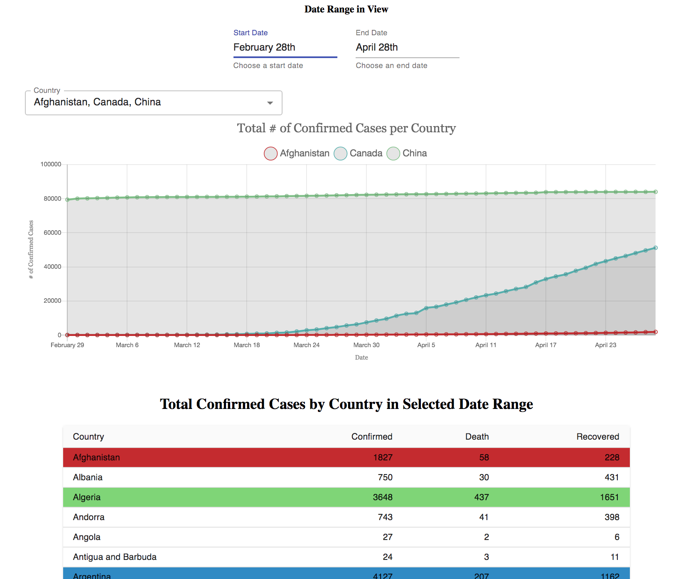

# COVID-19 Tracker


## About
This React-SPA aims to visualize COVID-19 cases across different countries. The dataset I used can be found [here](https://pomber.github.io/covid19/timeseries.json). The features of this app include:
1) A `home` page which has a timeseries plot of confirmed cases by country over a selected time range. This graph can plot multiple countries at once. The user can add and remove countries from the plot using a dropdown menu; and can adjust the time range using the date range picker above.
2) Below the timeseries is a table of each country and their confirmed number cases, deaths, and recovered within the selected time range (so notice these numbers are adjusted when the time range is changed).
3) Each country in the timeseries plot and table can be assigned a color for better visualization. Follow the button at the bottom of the `home` page to be taken to the `settings` page of the SPA. Here, there is a panel to choose a country and a color and button to assign the color to that country. Below this panel is a table that lists the country-to-color settings. Navigate back to the `home` page to see the colors reflected on the plot and table.
4) At the top of the `home` page is a summary of world total confirmed cases, deaths, and recovered.

## Notes
### Implementation
- This project was initially started from React's `create-react-app`
- I used the HTTP Client `Axios` to fetch and cache the dataset.
- I used pure React to manage global state by implementing a `store`, `dispatch`, and `actions` (Redux-like concepts) using `React's Context API` built on top of `React Hooks`.
- I largely used `MaterialUI` to build the components. I aimed to make these components standalone so that they can be easily reused. This is with the exception of the `Timeseries` component because it very specific to the page so it didn't make sense to generalize. And also the `Card` component used to show the world stats was just added for fun so I didn't bother generalizing that one either.
- The timeseries chart was created using a popular charting library `React-Chartjs-2`.
- In efforts to make the app as responsive as possible, I used combination of CSS Media Queries and MaterialUI Grids. One pain point was the timeseries chart which did not come with great responsive capabilites. To get around that, I manipulated the chart dimensions through a callback called everytime before the chart is redrawn. This was a little bit hacky.
- I used `React-Router` to route between the `home` page and `settings` page.
- I implemented a full suite of unit tests written in `Jest` to test the utilities functions and api parsers. I also used `Enzyme` to more easily test React components which I only included very basic tests for.
- To prevent jumping of components upon loading data from the server, I added placeholders where the components should go. This is only seen on the first load (or hard navigation) since the data is cached thereafter.

### Improvements
- CSS Preprocessor: Since this app is quite small with not much styling repetition and since much of the styling came with MaterialUI, I decided not to go the extra effort to use a css preprocessor like SASS.
- The Material UI dropdown menu is slow! I chose to use a feature on their dropdown that allows multiple items to be selected and with the amount of countries there are, this became very slow. To optimize performance, I would either try to implement some sort of debounce so that not all the countries would be rendered at once or just simply not use a dropdown and rather a list that persists on the page.
- Other nice to haves that I would include in a project that was not included here: CircleCI integration; minifying build files; and a more complete testing suite for the React components + integration tests.

## Requirements
```
  node@^10.17.0
  npm@^5.7.1
```

## Setup

Install dependencies using npm:

```bash
npm i
```

## Run App

Run app with:

```bash
  npm start
```

## Testing

Run tests with:

```bash
  npm test
```

## Building

Run tests with:

```bash
  npm build
```